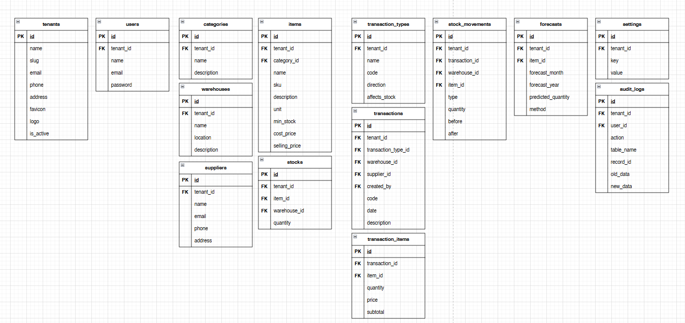
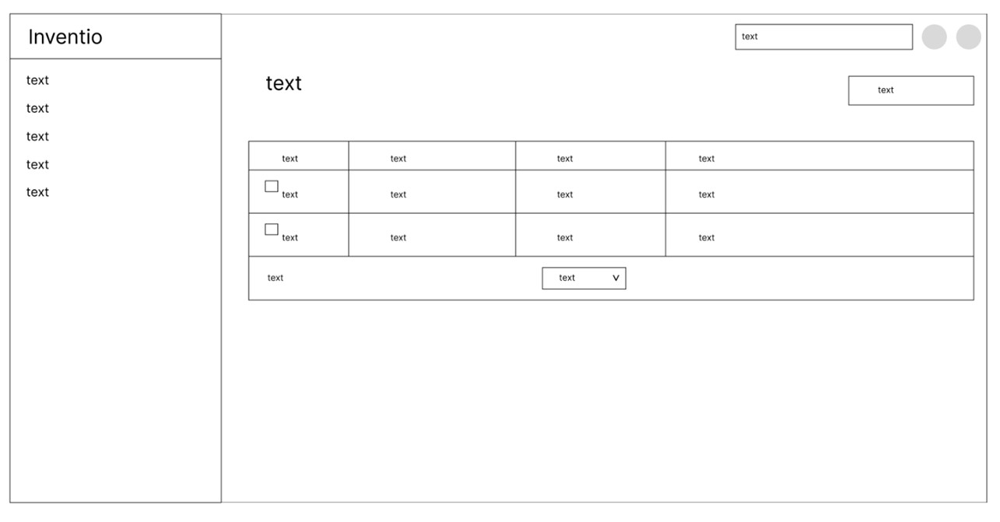

# Modul 2 – Perancangan Produk (SDLC)

---

## Metodologi SDLC yang Digunakan

**Agile Scrum**

---

## Alasan Pemilihan Metodologi

1. Kebutuhan sistem inventaris UMKM berpotensi berubah saat implementasi
2. Membutuhkan iterasi cepat agar fitur inti segera bisa digunakan
3. Tim pengembang berukuran kecil
4. Proses komunikasi dapat dilakukan melalui daily stand-up singkat
5. Cocok untuk pengembangan berbasis sprint selama 1 semester

---

## Perancangan Tahap 1–3 SDLC

### Tujuan Produk

Produk **Inventio** bertujuan untuk:

- Menyediakan sistem manajemen inventaris berbasis web yang sederhana dan ringan
- Meminimalkan selisih stok antara fisik dan sistem
- Menyediakan laporan stok otomatis
- Memberikan notifikasi ketika stok mendekati batas minimum
- Memungkinkan pencatatan barang masuk dan keluar secara terstruktur
- Menyediakan riwayat pergerakan barang

---

### Pengguna Potensial dan Kebutuhannya

#### Pemilik UMKM (Owner)

Kebutuhan:

- Melihat ringkasan stok secara cepat
- Mendapat notifikasi stok minimum
- Melihat laporan stok
- Monitoring performa inventaris

#### Admin

Kebutuhan:

- Mengelola data barang
- Mengelola kategori
- Mengelola supplier
- Mengelola gudang
- Melihat pergerakan stok

#### Staff Gudang

Kebutuhan:

- Input stok masuk
- Input stok keluar
- Melihat daftar barang
- Melihat stok terkini

---

## Use Case Diagram

---

## Functional Requirements

| Kode  | Deskripsi |
|-------|-----------|
| FR-01 | Sistem menyediakan fitur login untuk Super Admin, Admin, dan Staff |
| FR-02 | Super Admin dapat mengelola data tenant (tambah, ubah, hapus) |
| FR-03 | Super Admin dapat melihat daftar tenant |
| FR-04 | Admin dapat mengelola kategori barang |
| FR-05 | Admin dapat mengelola data barang |
| FR-06 | Admin dapat mengelola data supplier |
| FR-07 | Admin dapat mengelola data warehouse/gudang |
| FR-08 | Admin dapat melihat informasi stok barang secara real-time |
| FR-09 | Admin dapat melihat riwayat pergerakan stok |
| FR-10 | Admin dapat melihat forecast kebutuhan stok |
| FR-11 | Admin dapat mengelola data pengguna sistem |
| FR-12 | Staff dapat melihat daftar barang |
| FR-13 | Staff dapat melihat informasi stok barang |
| FR-14 | Staff dapat membuat transaksi stok masuk dan keluar |
| FR-15 | Sistem otomatis memperbarui jumlah stok setelah transaksi |

---

## Entity Relationship Diagram (ERD)

---

## Low-Fidelity Wireframe

---

## Gantt Chart Pengerjaan (1 Semester – 12 Pertemuan)

| Kegiatan | 1 | 2 | 3 | 4 | 5 | 6 | 7 | 8 | 9 | 10 | 11 | 12 |
|----------|---|---|---|---|---|---|---|---|---|----|----|----|
| Requirement & Design | ✔ | ✔ | | | | | | | | | | |
| ERD & Wireframe | | ✔ | ✔ | | | | | | | | | |
| Setup Project | | | ✔ | | | | | | | | | |
| Sprint 1 (CRUD Barang) | | | | ✔ | ✔ | | | | | | | |
| Sprint 2 (Stok Masuk/Keluar) | | | | | ✔ | ✔ | | | | | | |
| Sprint 3 (Dashboard) | | | | | | ✔ | ✔ | | | | | |
| Sprint 4 (Reporting) | | | | | | | ✔ | ✔ | | | | |
| Sprint 5 (Notifikasi) | | | | | | | | ✔ | ✔ | | | |
| Testing & Bug Fixing | | | | | | | | | ✔ | ✔ | | |
| Deployment | | | | | | | | | | ✔ | | |
| Dokumentasi & Finalisasi | | | | | | | | | | | ✔ | ✔ |